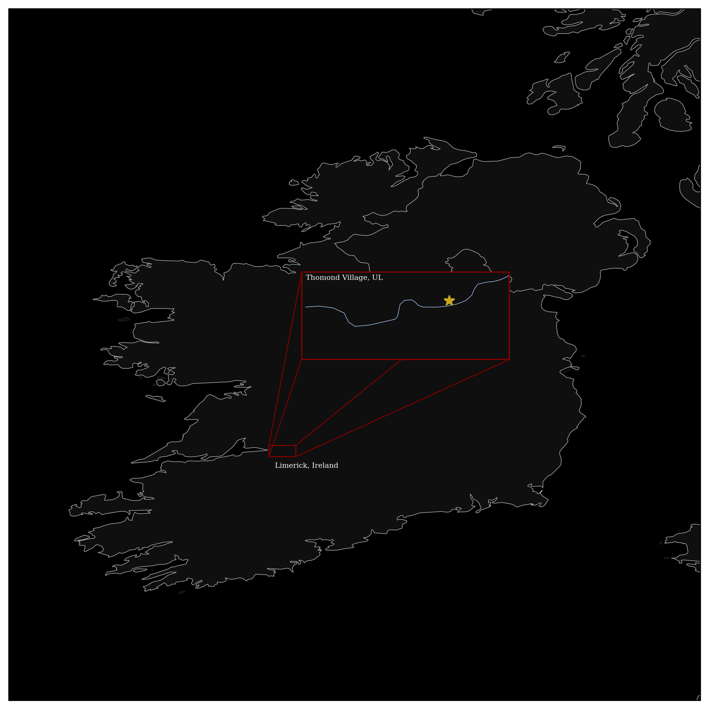

## LOCATOR

### Getting Started
```bash
pip install cairosvg pillow matplotlib numpy scipy cartopy
```

### Usage (driver.jl)

Renders locator maps for an entire directory of photos by parsing EXIF metadata. Optionally generates datetime clock images for each photo and a world-zoom summary of the location of all photos.

```bash
julia driver.jl \
	--dir "C:\\path\\to\\photos" \
	--python python \
	--snapshot-script snapshot.py \
	--map-dir "C:\\path\\to\\photos\\_locator_maps" \
	--overwrite-maps \
	--theme-file themes/default_dark.json \
	--non-interactive
```

### Usage (snapshot.py)

Renders a single locator map with a zoom insert.

```bash
python snapshot.py \
	--world-region -11 -5 50.5 56.5 \
	--zoom-region -8.742559512271514 -8.510014263814636 52.614007667018164 52.71198728589052 \
	--star 52.6698042403715 -8.577276842533156 \
	--theme themes/default_dark.json \
	--title-main "Limerick, Ireland" \
	--title-inset "The University of Limerick" \
	--out locator_map_styled.png
```

### Notes
See themes/default_dark.json for information on configuring a custom map color scheme.

### Credits
Natural Earth Vector for shapefile data.
https://github.com/nvkelso/natural-earth-vector/tree/master?tab=License-1-ov-file
